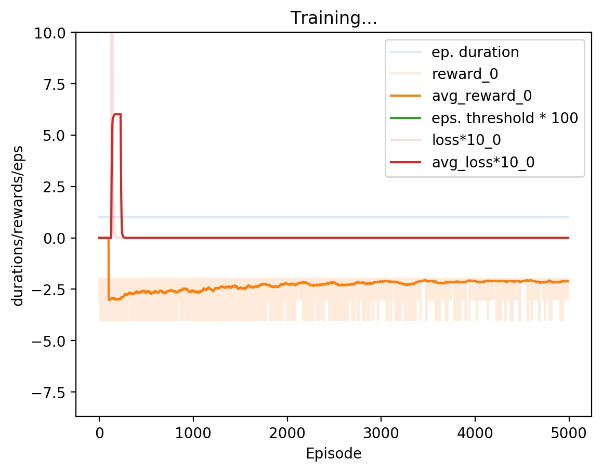
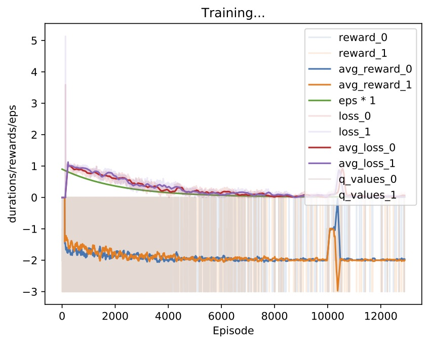
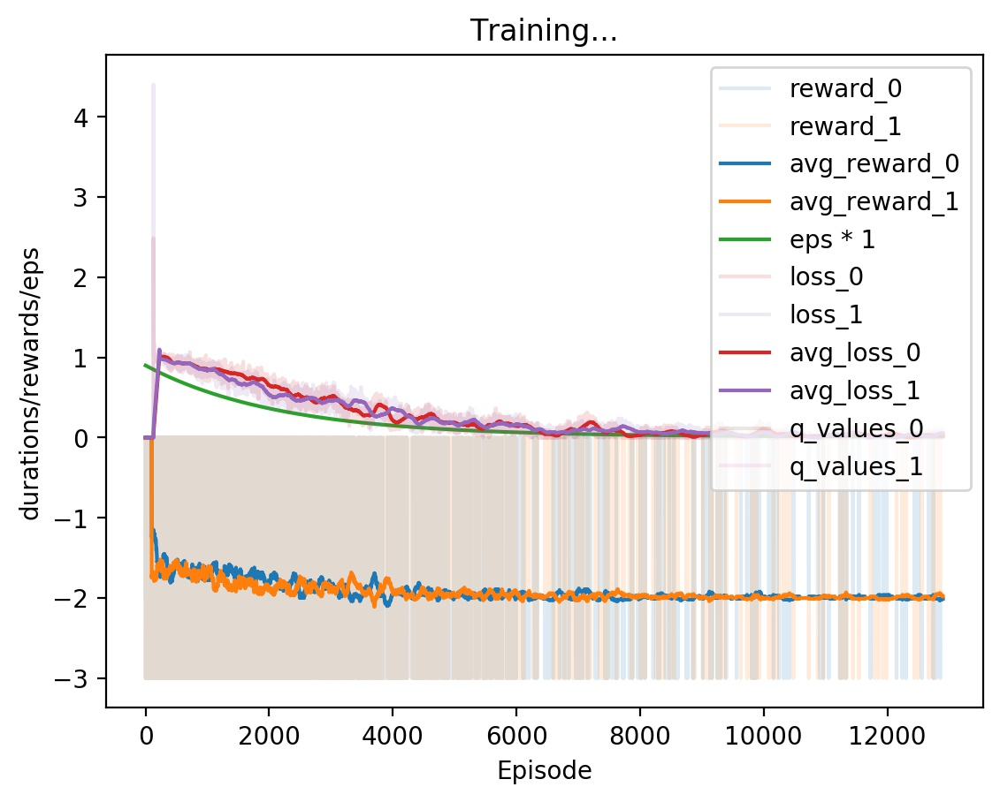

# vcg_dqn

Code testing a reward redistribution idea using VCG auctions for decentralized RL. Results showed that it didn't really work... Archiving this for reference later. 

## Requirements 

- python3 
- matplotlib
- PyTorch 1.0+ 
- Numpy 

## Structure 

`models.py`: classes for `DQN` networks and the `DDQNAgent`, `QMixer`, and the `VCG` module. 
Note: there is a separate `VCG_DDQNAgent` class for using the `VCG` module because of the way actions are chosen. 

`envs.py`: Iterated Prisoner's Dilemma (IPD), Global version of IPD, and the Levers coordination env (not used) 

`common_utils.py`: mostly plotting functions 

##### Run files 

`basic_ddqn.py`: Originally copied from our Jupyter notebook. Contains code for Global IPD (one agent solving both sides), independed Q-learning IPD, and independent + VCG DDQNAgent. 

`centralized.py`: `VCG_DDQNAgent` that conditions on both sides but chooses actions independently 

`joint_actions.py`: `VCG_DDQNAgent` that conditions on both sides, each agent chooses the best global action, and only their local action is taken 

##### Results

Global:   (note: converging to -2 is cooperating in this version) 

Centralized:

Joint action: 
